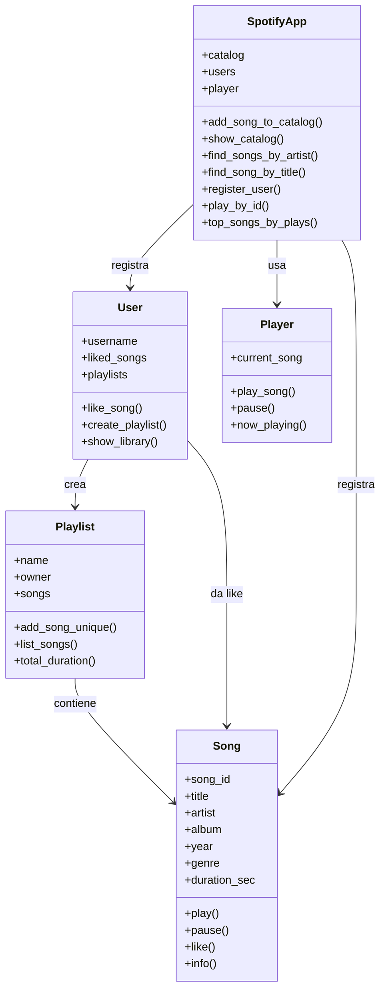
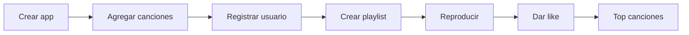

# Clase 01 - Prework Python (OOP Mini-Spotify)

Esta clase introduce Programacion Orientada a Objetos con un mini sistema tipo Spotify.

## Objetivos
- Entender clases e instancias.
- Diferenciar atributos vs metodos.
- Usar `__init__` y `self` correctamente.
- Conectar objetos en un sistema simple.

## Estructura de la clase
- `notebooks/`: notebook con teoria y codigo.
- `codigo/`: scripts y ejercicios.
- `planes_clase/`: planes de clase en Markdown.
- `assets/`: documentos base (DOCX).

## Diagrama de clases

## Flujo de la app

## Archivos clave
- Notebook: `notebooks/clase.ipynb`
- Script base: `codigo/clase.py`
